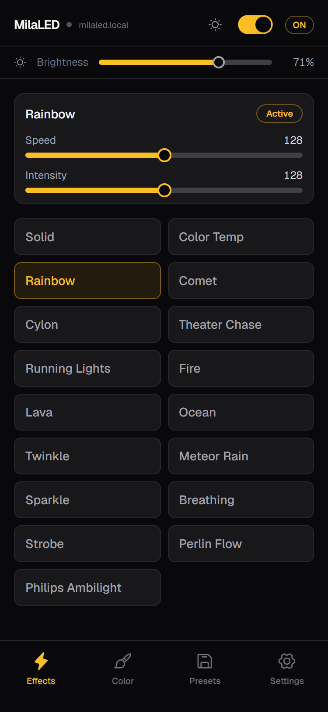
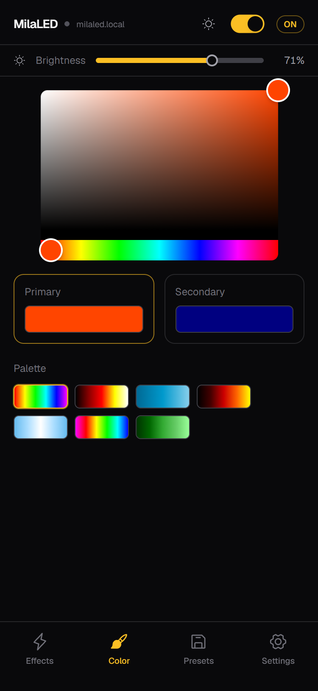
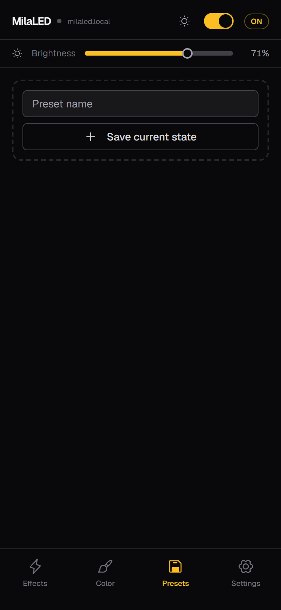
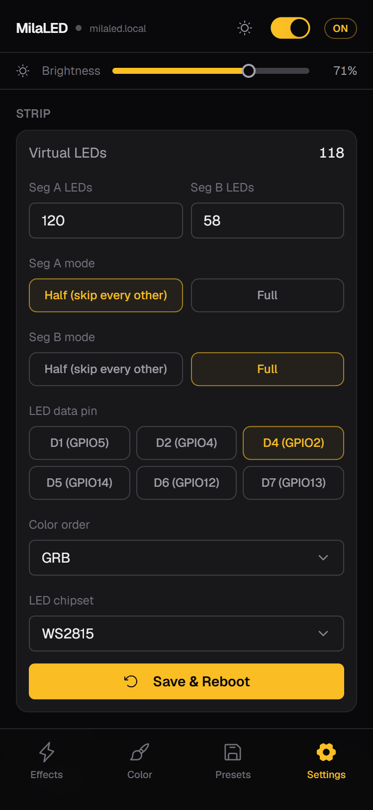

# MilaLED

ESP8266 / ESP32 Wi-Fi LED strip controller with a modern mobile-first web interface. Control your WS2815 (or compatible) LED strip from any device on your network — no app required.

**Works with:** WS2811, WS2812B, WS2815, WS2813, SK6812 | RGB, GRB, and more

<table align="center"><tr>
<td align="center" width="195">
  <br/>
  <sub>Effects</sub>
</td>
<td align="center" width="195">
  <br/>
  <sub>Color</sub>
</td>
<td align="center" width="195">
  <br/>
  <sub>Presets</sub>
</td>
<td align="center" width="195">
  <br/>
  <sub>Settings</sub>
</td>
</tr></table>

## Features

- **17 animated effects** — Rainbow, Fire, Comet, Ocean, Breathing, Strobe, and more
- **Philips Ambilight integration** — mirror your Philips TV's ambient lighting
- **Network scanner** — automatically discover Philips TVs on your LAN
- **Two-segment strip support** — configurable LED counts with half-density skipping
- **Configurable color order** — RGB, GRB, BRG — match whatever your strip expects
- **Presets** — save and recall your favorite setups
- **English / Polish** — auto-detected, toggleable
- **Dark & light theme**
- **No cloud, no app, no account** — self-contained on the ESP

## Supported boards

| Platform | Boards | RAM | Flash |
|----------|--------|-----|-------|
| **ESP8266** | ESP-12E, NodeMCU, Wemos D1 mini, Adafruit HUZZAH | 80 KB | 2-4 MB |
| **ESP32** | ESP32 DevKit, NodeMCU-32S, ESP32-S3, ESP32-C6 | 320-520 KB | 4-16 MB |

Virtually any ESP8266 with ≥2MB flash or any ESP32 with ≥4MB flash works. See `platformio.ini` for pre-configured environments — just uncomment your board.

## Hardware

| Component | Details |
|-----------|---------|
| **Board** | ESP8266 (ESP-12E/NodeMCU/Wemos D1) or ESP32 (DevKit/S3/C6) |
| **Strip** | WS2815 (WS2811/WS2812B/WS2813/SK6812 also supported) |
| **Data pin** | Configurable (GPIO 2, 4, 5, 12, 13, 14) |
| **Color order** | Configurable (RGB, RBG, GRB, GBR, BRG, BGR) |

Default setup: 120 + 58 physical LEDs across two segments, GPIO2 data pin, GRB color order.

## Getting Started

### 1. Set up PlatformIO

Install [PlatformIO](https://platformio.org/install) (VS Code extension or CLI):

```bash
pip install platformio
```

### 2. Pick your board

Edit `platformio.ini` and set `default_envs` to your board:

```ini
; ESP8266
default_envs = esp12e     # ESP-12E (default)
default_envs = nodemcuv2  # NodeMCU 1.0
default_envs = d1_mini    # Wemos D1 mini

; ESP32
default_envs = esp32dev           # ESP32 DevKit / WROOM
default_envs = nodemcu-32s        # ESP32-S2
default_envs = esp32-s3-devkitc-1 # ESP32-S3
```

### 3. Build the web UI

```bash
python scripts/build_web.py
```

This runs `npm build` in `web/`, gzips the output, and places it in `data/`.

### 4. Flash

Connect your board via USB, then:

```bash
# Flash the web files (LittleFS)
pio run --target uploadfs

# Flash the firmware
pio run --target upload
```

### 5. Connect

On first boot, the board creates a Wi-Fi hotspot called **MilaLED**. Connect to it, open a browser, and follow the captive portal to connect to your home network. Once connected, go to `http://milaled.local` (or the IP shown in settings).

## Development

```bash
# Web UI with hot-reload
cd web && npm run dev      # → http://localhost:5299

# Firmware
pio run                     # compile
pio run --target upload     # flash firmware only
pio device monitor          # serial output (115200 baud)
```

**Project structure:**

```
├── src/              # Arduino firmware
│   ├── config/       # ConfigStore (LittleFS JSON)
│   ├── leds/         # EffectsEngine + 17 effects
│   ├── net/          # HTTP + WebSocket server
│   └── wifi/         # WiFi Manager + mDNS
├── web/              # React 18 + Vite + Tailwind UI
│   └── src/
│       ├── components/  # tabs, layout, shared, ui
│       ├── hooks/       # useLedState, useWebSocket
│       └── i18n/        # English, Polish
├── data/             # gzipped web build (uploaded to ESP)
├── scripts/          # build_web.py
├── test/             # native unit tests
└── platformio.ini
```

## API

| Endpoint | Method | Description |
|----------|--------|-------------|
| `/ws` | WebSocket | Real-time control + state sync |
| `/api/strip` | POST | Save LED config (triggers reboot) |
| `/api/presets` | GET/POST/DELETE | Manage saved presets |
| `/api/ambilight/scan` | POST | Start network scan for Philips TVs |
| `/api/ambilight/scan/cancel` | POST | Cancel running scan |
| `/api/wifi/reset` | POST | Erase Wi-Fi credentials, restart in AP mode |

WebSocket commands are simple JSON: `{"power": true}`, `{"brightness": 180}`, `{"effect": "fire2012"}`, etc. The ESP broadcasts full state to all connected clients on connect and after any discrete change.

## License

MIT
