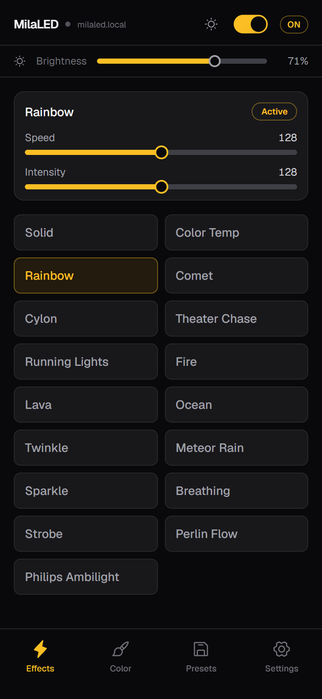
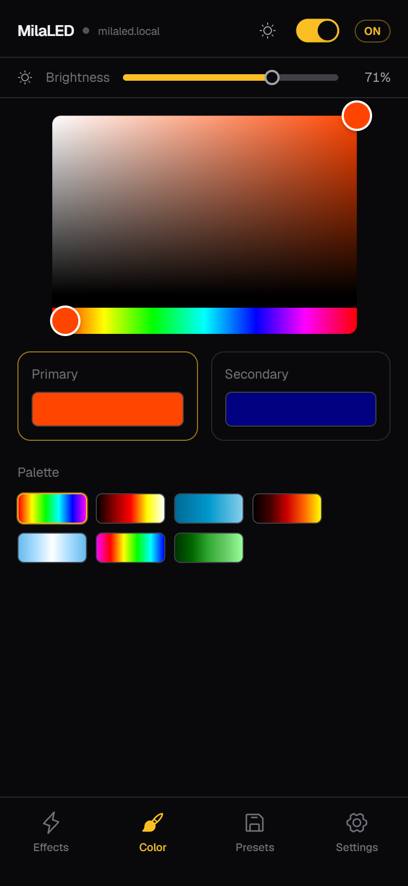
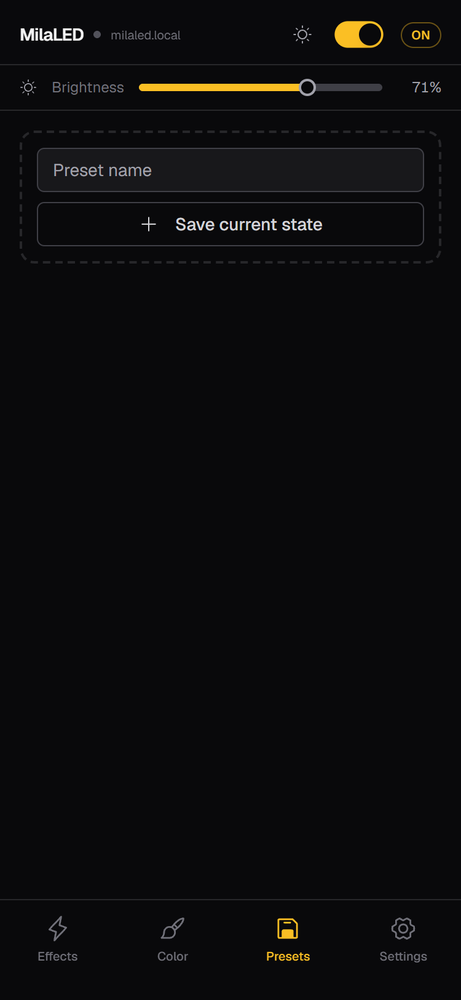
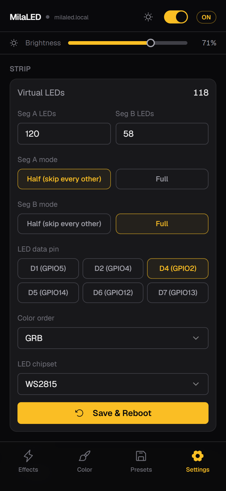

# MilaLED

ESP32 LED strip controller with a modern mobile-first web interface. Control your WS2815 (or compatible) LED strip over Wi-Fi from any device on your network, or over Bluetooth LE without joining the network at all — no app required.

**Works with:** WS2811, WS2812B, WS2815, WS2813, SK6812 | RGB, GRB, and more

<table align="center"><tr>
<td align="center" width="195">
  <br/>
  <sub>Effects</sub>
</td>
<td align="center" width="195">
  <br/>
  <sub>Color</sub>
</td>
<td align="center" width="195">
  <br/>
  <sub>Presets</sub>
</td>
<td align="center" width="195">
  <br/>
  <sub>Settings</sub>
</td>
</tr></table>

## Features

- **18 animated effects** — Rainbow, Fire, Comet, Ocean, Breathing, Strobe, and more
- **Philips Ambilight integration** — mirror your Philips TV's ambient lighting (zero-latency HTTP polling)
- **Hyperion/HyperHDR support** — WLED-compatible UDP streaming (DDP + RAW, ports 4048 + 19446)
- **Network scanner** — automatically discover Philips TVs on your LAN
- **Bluetooth LE control & provisioning** — an always-on control and Wi-Fi provisioning channel; pair directly from a browser via the [hosted control page](https://im-tesla.github.io/MilaLED/), no app required
- **Multi-segment strip support** — up to 4 segments with configurable LED counts and half-density skipping
- **Configurable color order** — RGB, GRB, BRG — match whatever your strip expects
- **Configurable chipset** — WS2811, WS2812B, WS2815, WS2813, SK6812
- **Presets** — save and recall your favorite setups
- **English / Polish** — auto-detected, toggleable
- **Dark & light theme**
- **LED status indicator** — blue boot, green connected
- **No cloud, no app, no account** — self-contained on the ESP

## Supported boards

| Platform | Boards | RAM | Flash | Bluetooth |
|----------|--------|-----|-------|-----------|
| **ESP32-C3** | LOLIN C3 Mini, ESP32-C3 Super Mini | 320 KB | 4 MB | ✓ |
| **ESP32** | ESP32 DevKit, NodeMCU-32S, ESP32-S3, ESP32-C6 | 320-520 KB | 4-16 MB | ✓ |

Virtually any ESP32 with ≥4MB flash works. See `platformio.ini` for pre-configured environments — just select your board.

## Hardware

| Component | Details |
|-----------|---------|
| **Board** | ESP32 (DevKit/S3/C6/C3) |
| **Strip** | WS2815 (WS2811/WS2812B/WS2813/SK6812 also supported) |
| **Data pin** | Configurable (GPIO 2, 4, 5, 12, 13, 14, 15, 16, 21, 22, 23, 25, 26, 27, 32, 33) |
| **Color order** | Configurable (RGB, RBG, GRB, GBR, BRG, BGR) |

Default setup: 120 + 58 physical LEDs across two segments, GPIO2 data pin, GRB color order.

## Getting Started

### 1. Set up PlatformIO

Install [PlatformIO](https://platformio.org/install) (VS Code extension or CLI):

```bash
pip install platformio
```

### 2. Pick your board

Edit `platformio.ini` and set `default_envs` to your board:

```ini
; ESP32 Boards
default_envs = esp32-c3-supermini  # ESP32-C3 Super Mini (default)
default_envs = esp32dev            # ESP32 DevKit / WROOM
default_envs = nodemcu-32s         # ESP32-S2
default_envs = esp32-s3-devkitc-1  # ESP32-S3
default_envs = esp32-c6-devkitc-1  # ESP32-C6
```

### 3. Build the web UI

```bash
python scripts/build_web.py
```

This runs `npm build` in `web/`, gzips the output, and places it in `data/`.

### 4. Flash

Connect your board via USB, then:

```bash
# Flash the web files (LittleFS)
pio run --target uploadfs

# Flash the firmware
pio run --target upload
```

### 5. Wi-Fi Provisioning & Control via Bluetooth

MilaLED uses Bluetooth LE for both live control and wireless Wi-Fi provisioning without any SoftAP or captive portal:

1. Open **https://im-tesla.github.io/MilaLED/** in Google Chrome (Desktop, Android) or the [Bluefy](https://apps.apple.com/app/bluefy-web-ble-browser/id1492822055) app (iOS).
2. Tap **Connect via Bluetooth** and pair with your **MilaLED** device.
3. In the **Settings** tab, scan for your 2.4 GHz Wi-Fi network, enter the password, and click **Connect**.
4. Once connected, your strip displays its assigned IP address (e.g. `http://192.168.1.166` or `http://milaled.local`) where you can also access the web interface directly on your local network.

## Development

```bash
# Web UI with hot-reload
cd web && npm run dev      # → http://localhost:5299

# Firmware
pio run                     # compile
pio run --target upload     # flash firmware only
pio device monitor          # serial output (115200 baud)
```

**Project structure:**

```
├── src/              # Arduino firmware
│   ├── config/       # ConfigStore (LittleFS JSON)
│   ├── leds/         # EffectsEngine + 17 effects
│   ├── net/          # HTTP + WebSocket server + BLE GATT server (ESP32)
│   └── wifi/         # WiFi Manager + mDNS
├── web/              # React 18 + Vite + Tailwind UI
│   └── src/
│       ├── components/  # tabs, layout, shared, ui
│       ├── hooks/       # useLedState, useWebSocket, useBluetoothTransport
│       └── i18n/        # English, Polish
├── data/             # gzipped web build (uploaded to ESP)
├── scripts/          # build_web.py
├── test/             # native unit tests
├── .github/workflows/ # deploys the Bluetooth control page to GitHub Pages
└── platformio.ini
```

## API

| Endpoint | Method | Description |
|----------|--------|-------------|
| `/ws` | WebSocket | Real-time control + state sync |
| `/api/strip` | POST | Save LED config (triggers reboot) |
| `/api/presets` | GET/POST/DELETE | Manage saved presets |
| `/api/ambilight/scan` | POST | Start network scan for Philips TVs |
| `/api/ambilight/scan/cancel` | POST | Cancel running scan |
| `/api/wifi/reset` | POST | Erase Wi-Fi credentials, restart in AP mode |
| `/json/info` | GET | WLED-compatible device info (Hyperion uses this) |
| `/json/state` | GET/POST | WLED-compatible state (Hyperion configures via this) |
| `/json` | GET/POST | Combined state+info (Hyperion discovery) |

WebSocket commands are simple JSON: `{"power": true}`, `{"brightness": 180}`, `{"effect": "fire2012"}`, etc. The ESP broadcasts full state to all connected clients on connect and after any discrete change.

### Bluetooth LE (ESP32 only)

Alongside the endpoints above, ESP32 boards expose a custom GATT service for control without Wi-Fi:

| | UUID |
|---|---|
| Service | `7a2eec00-4b0f-4bde-9f3f-1a7c6d9b2e10` |
| Command characteristic (write) | `7a2eec01-4b0f-4bde-9f3f-1a7c6d9b2e10` |
| State characteristic (notify) | `7a2eec02-4b0f-4bde-9f3f-1a7c6d9b2e10` |

Both characteristics carry the same JSON shape as the WebSocket API (restricted to the v1 core-control fields), chunked into `[seq: uint8][more: uint8][...JSON bytes]` frames — `seq == 0` starts a new message, `more == 0` marks the last chunk — since a single BLE packet is too small to carry a full state update. The [hosted control page](https://im-tesla.github.io/MilaLED/) ([source](web/src/hooks/useBluetoothTransport.ts)) is the reference client; the firmware side lives in [`src/net/BleServer.cpp`](src/net/BleServer.cpp).

### Hyperion / HyperHDR

MilaLED emulates a WLED device for seamless Hyperion integration:

1. Activate the **Hyperion / HyperHDR** effect in the Effects tab
2. In Hyperion, add a **WLED** controller pointing to your ESP's IP address
3. The ESP auto-discovers via mDNS (\_wled.\_tcp) and accepts streams on both:
   - **DDP** (port 4048) — default Hyperion WLED protocol
   - **RAW** (port 19446) — WLED raw RGB port
4. Zero-latency: UDP frames bypass the effect pipeline and write directly to the LED strip

## License

MIT
